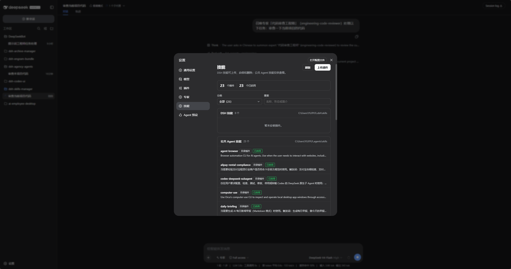
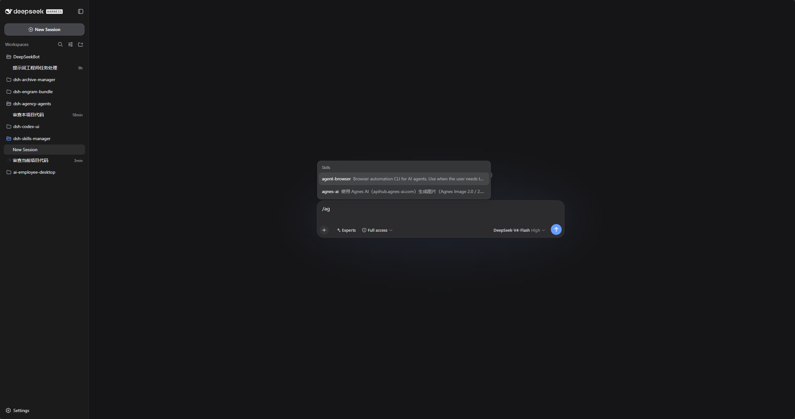
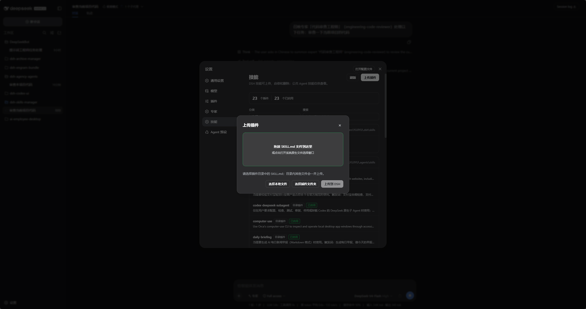
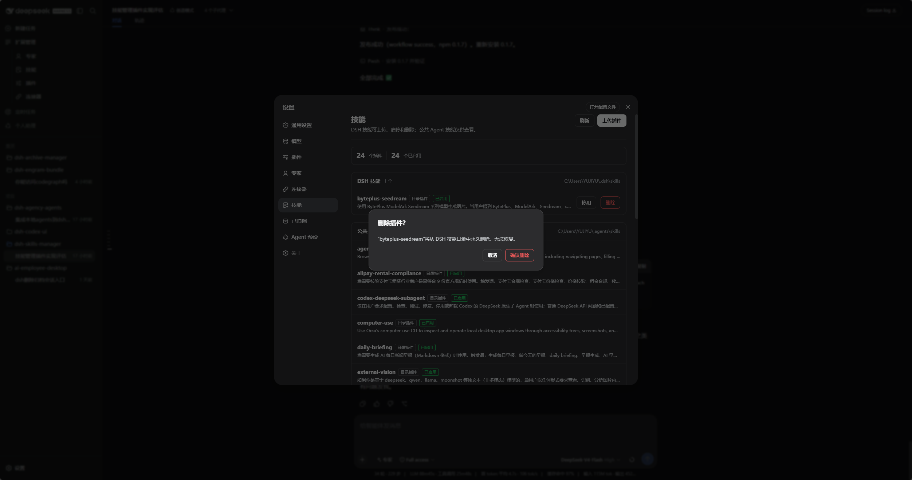

# 使用说明

更新时间：2026-08-17 12:10（Asia/Shanghai）

## 适用范围

本说明面向 DSH Web 的「设置 → 技能」面板使用者。插件管理两个用户级技能目录，不管理项目级技能目录。

  

> 截图展示「设置 → 技能」面板。可用分类和搜索收窄列表；DSH 本地技能可启用、停用和删除；公共 Agent 技能只读。

## 目录权限

| 技能来源 | 可以做什么 | 不可以做什么 |
|---|---|---|
| DSH 技能目录 `$DSH_HOME\skills` | 查看、启用、停用、上传、覆盖、删除 | 无 |
| 公共 Agent 技能目录 `$DSH_AGENTS_HOME\skills` | 查看 | 启用、停用、上传、覆盖、删除 |

公共 Agent 目录为共享目录；即使直接调用接口，服务端也会拒绝所有修改操作。

  

> 未安装 DSH 本地技能时，仍可按分类或关键词查看公共 Agent 技能列表。

## 常见操作

### 搜索与筛选

摘要条下方可按分类收窄，并按名称、形态或简介即时搜索。无匹配时会出现空结果提示，点击「清除筛选」即可恢复完整列表。公共 Agent 技能仍只读，筛选不会改变权限。

### 启用或停用

仅在 DSH 技能条目右侧点击「启用」或「停用」。停用会同时关闭模型调用和 `/` 手动调用；启用会恢复两种入口。公共 Agent 技能只读，不提供任何修改按钮。

  

> 启用后，聊天输入框可通过 `/` 命令调用该本地技能。

### 上传 DSH 技能

1. 点击页面右上角「上传插件」。
2. 使用系统原生文件选择器选择插件目录内的 `SKILL.md`。
3. 若宿主无法返回文件路径，弹窗会提示并保持打开；再由用户主动选择整个插件目录，目录中必须包含 `SKILL.md`。
4. 发现同名技能时（包括目录插件与单文件插件同名），确认覆盖或取消；确认覆盖后只保留新上传的形态。

上传会复制整个插件目录，以保留脚本、模板和资源文件。

  

> 上传弹窗支持拖放 `SKILL.md`、选择本地文件，或改选整个插件目录。

### 删除 DSH 技能

只在 DSH 技能分组中使用「删除」。确认后会删除该技能文件或目录；公共 Agent 分组没有删除入口。

  

> 删除前会弹出确认框。确认后从 DSH 技能目录永久删除，无法恢复。

### 关闭弹窗

按 ESC 只关闭当前最上层弹窗。若存在覆盖或删除确认框，会先关闭确认框，再关闭上传框，设置页保持打开。

## 常见问题

| 现象 | 处理方式 |
|---|---|
| 上传后出现失败提示 | 失败原因会直接显示；批量上传时，成功项会保留，失败项需修复后重新上传。 |
| 选择文件后无内容变化 | 查看上传弹窗内的选择状态或错误提示；确认所选文件名为 `SKILL.md`。 |
| 公共 Agent 技能列表为空 | 确认运行中的 DSH 已加载当前插件版本，并检查 `$DSH_AGENTS_HOME\skills` 是否存在。 |
| 仍然显示旧界面 | 重新加载插件并重启 DSH Web profile。 |

